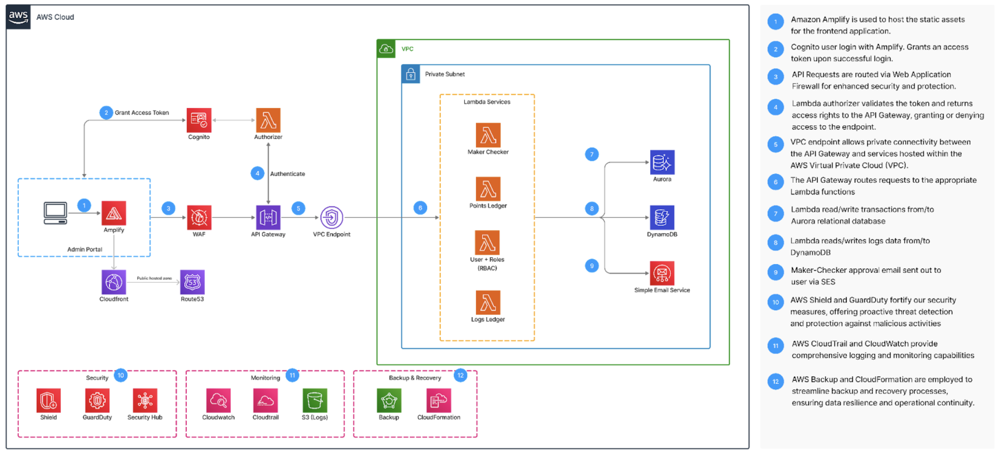

# Ascenda Loyalty Points System - Backend

Backend Repository for Ascenda LP System leveraging Amazon Web Services (AWS) Serverless Infrastructure.

## Project Overview

- **Background:** Ascenda operates a comprehensive administrative subsystem crucial for managing back-office operations and facilitating customer support across various departments.
- **Objective:** The project aims to develop an advanced administrative system that incorporates robust authentication, fine-grained access control, seamless integration with multiple backend applications, and comprehensive logging functionalities.

## Solution Architecture

- Our architecture employs a serverless approach using AWS services to ensure scalability, resilience, and ease of maintenance. The core components include AWS Lambda for processing, API Gateway for managing API requests, and Amazon Aurora for database management. 
- This architecture is designed to abstract infrastructure management, streamline deployment processes, and reduce operational overhead.

## Technologies Utilised
<div align="center">
  <h3>Cloud Platform & Services</h3>
  
  <p><strong>AWS Services</strong></p>
  
  
  
  

  
  

  <h3>DevOps</h3>
  
  
  

  <h3>Programming Languages & Framework</h3>
  
  
</div>


## Setting up the backend

```sh
# Build & Run package locally
make build-run

# Build & Deploy
make deploy

# Teardown (Do NOT teardown unless necessary)
make teardown
```

## Others

- Link to Frontend Repository
- Link to Terraform
